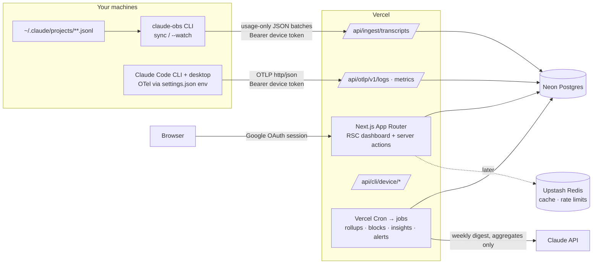

# Claude Observability: Implementation Plan (Max-plan first)

This is a web app deployed on Vercel. You sign in with Google, link the machines where you run Claude Code, and see where your usage goes: per session, per model, per project and per 5-hour limit window. It also shows how much API-equivalent value your subscription delivers, and gives forecasts, alerts and written insights.

**Primary audience: individual Claude subscribers (Max 5x / Max 20x / Pro).** Team, Enterprise and API organizations are a later add-on (§13, Phase 4).

---

## Build status (2026-10-08)

**Built and verified locally against real data:** Phases 0–3, plus the collector (C1–C4). See [README.md](README.md) for running and deploying.

| Area | State |
|---|---|
| Collector `claude-obs` | Parser, dedup, privacy, outbox, `sync`, `--watch`, `install-agent` (launchd/systemd/schtasks), `status`, `doctor`, `otel --install`, `config-dirs`, `logout`. 18 tests. |
| Ingest | Transcript batches, OTLP/HTTP JSON logs and metrics, account-hash pinning, version/size/rate guards, cross-machine and cross-source merge. |
| Auth & tenancy | Google sign-in, workspaces = Claude accounts, owner/viewer invites, enrollment codes, browser device approval, revocation, share links. |
| Dashboard | Overview (live block, plan value, completeness), Sessions + detail, Models, Projects, Limits (blocks, learned limit, heatmap, manual marks), Plan value, Insights (rules + AI digest), Alerts (Slack/webhook/e-mail), Settings, CSV export. Light and dark. |
| Jobs | Vercel Cron on the Hobby plan: alert sweep (daily), digest (weekly), retention (daily). Alerts also run after every upload. |
| Not done (Phase 4) | OTLP protobuf, Postgres RLS, standalone collector binaries, org Admin API / Enterprise Analytics connectors, Playwright E2E, load test. |

**Changed from the plan while building:**
- **Better Auth instead of Auth.js.** Auth.js v5 is still a beta release.
- **No Upstash or queue yet.** Per-account volume is small, so rate limits are in-memory per instance and dashboards aggregate straight from `api_requests`, with no rollup tables. Add Upstash and rollups when there are many workspaces.
- **Collector state is JSON plus an outbox folder, not SQLite**, so there are no native dependencies. One enrollment per machine.
- **The hash salt is per workspace, not per machine**, so every machine on an account hashes identically.
- **Finding: session files miss 5–10% of usage.** Claude Code's side requests (titles, classifiers) never reach the transcripts, and `cost-state` covers only a session's last run. For exact totals, also enable OpenTelemetry (`claude-obs otel --install`); the server merges both sources by request id.

---

## 1. What data a Max account can actually provide

A Max account is an **individual subscription**, which has three consequences:

- **The Admin API is unavailable for individual accounts.** That rules out the Usage API, the Cost API and the Claude Code Analytics API. Every one of them needs an org Admin key.
- **Anthropic publishes no API for subscription quota.** Nothing reports "% of 5-hour limit used" or "weekly limit remaining". Anything about limits must be **reconstructed from your own usage**.
- **Billing is flat.** Per-token dollar figures are **API-equivalent value**: what the same tokens would have cost at API list prices. They are not money spent.

That leaves two sources, both produced by Claude Code on your own machines:

| # | Source | What it gives | Freshness | Role |
|---|---|---|---|---|
| **A** | **Local transcripts** (`~/.claude/projects/**`), uploaded by our `claude-obs` CLI | Every assistant request with model and full token usage, plus session metadata, titles, errors, compactions and subagent runs. **Includes all history before signup.** | Batch / `--watch` near-live | **Primary.** Works with zero configuration, and covers both the CLI and the Claude desktop app. |
| **B** | **Claude Code OpenTelemetry**, sent to our OTLP endpoint | Per-request `claude_code.api_request` events (with `session.id`, `cost_usd`, `duration_ms`, `effort`, `speed`, `query_source`, `agent.name`, `skill.name`, `mcp_server.name`), plus errors, refusals, tool decisions, LOC, commits, PRs and active time | Real time (~5 s) | **Secondary.** Adds live updates, latency, tool and productivity metrics, and coverage on machines where the CLI isn't installed. |

### What I verified on this machine (`~/.claude/projects`, 44 MB, 13 projects, ~3.2k assistant requests)
- **Entrypoints:** `claude-desktop` (2,210 requests) and `cli` (950). Both write to the same place, so one importer covers both.
- **Models seen:** `claude-opus-5`, `claude-sonnet-5`, `claude-sonnet-5-5`, `claude-sonnet-4-6`, `claude-opus-5-5`, plus `<synthetic>`. Drop `<synthetic>`: those are locally generated error and placeholder messages, not API calls.
- **Subagent transcripts** live in a separate folder, `<project>/<sessionId>/subagents/agent-*.jsonl`. They must be included, or subagent-heavy sessions are undercounted.
- **Record types worth parsing**, beyond `assistant`:
  - `cost-state`: Claude Code's own `totalCostUSD`, API duration, tool duration, lines added/removed, and per-model usage including `thinkingTokens`. Present in only some sessions; use it as a cross-check.
  - `ai-title` / `custom-title`: session names.
  - `system` subtypes: `turn_duration` (latency), `compact_boundary` (compactions), `away_summary`.
  - `isApiErrorMessage` + `error` on synthetic messages. Seen so far: `authentication_failed`, `invalid_request` ("Prompt is too long"), `unknown`. Usage-limit errors are expected to appear here too, and these drive **limit-hit detection**.
  - `agent-name`, `permission-mode`, `mode`.
- **Duplicate usage:** Claude Code writes one line per content block and repeats `usage` on each. Here, 3,301 assistant lines are only **1,889 unique requests**, so naive summing overcounts by ~75%. For 39 requests, `output_tokens` grows across those lines (streaming), and the **last line holds the final value**. Rule: one row per `requestId`; keep the last or max `output_tokens`. On the server, upsert with `GREATEST()`, because lines can arrive in different batches.
- **Cache writes** are split into `ephemeral_5m_input_tokens` and `ephemeral_1h_input_tokens`. They're priced differently, so keep both.

### Known gaps (show these in the UI)
- **Usage on claude.ai chat and in the Claude desktop chat tab** counts against the same Max limits, but no API or local file exposes it. Limit-proximity estimates are therefore a lower bound.
- **Cloud and remote Claude Code sessions** (claude.ai/code) don't write local transcripts. OpenTelemetry may cover them where env config is possible; otherwise they're missing.
- **The transcript format is internal and undocumented.** It can change between Claude Code versions. Mitigations are in §14.
- The app **never asks for or stores Claude login credentials or OAuth tokens**. Linking happens only through our own enrollment codes or device-code flow (§4.1).

---

## 2. Architecture



### Stack
| Concern | Choice | Why |
|---|---|---|
| Framework | **Next.js (App Router) + TypeScript** | Vercel-native. Server Components keep queries server-side. |
| Auth | **Better Auth, Google provider**, database sessions (Drizzle adapter) | Scopes are `openid email profile` only, which are non-sensitive, so Google review is light. |
| DB | **Neon Postgres** (Vercel Marketplace) + **Drizzle** | Per-user volume is small (thousands of requests a month). Postgres with rollups is plenty, and branching suits preview deploys. |
| Cache / live | **Upstash Redis** | Ingest rate limiting, dashboard query cache, and the current 5-hour block's running state. |
| Jobs | **Vercel Cron** (Hobby plan: daily jobs) | Alert sweep, weekly digest, retention. Alerts also run after each upload. Move to Pro for sub-daily sweeps; a queue (QStash/Inngest) is only needed once user count grows. |
| UI | Tailwind + **shadcn/ui**, **Recharts**, **TanStack Table**, `nuqs` (URL state) | |
| CLI | Node + TypeScript, published to npm as `claude-obs` | Runs anywhere Claude Code runs (Node is already present). |
| Validation | **Zod** shared by web and CLI (`packages/shared`) | One schema for the upload contract. |
| Tests / ops | Vitest, Playwright, Sentry, Vercel Analytics | |

---

## 3. Account, machines and dashboard access

The unit of analysis is **one Claude account**: the subscription and its shared limits. The plan does **not** break usage down by person. The goal is complete, correctly deduplicated account totals, however many people or machines use the account.

- **Workspace = one Claude account.** On signup, the owner creates a workspace for the account and picks the plan: Pro, Max 5x or Max 20x. The CLI can also auto-detect the plan (see below). The monthly price is editable, with effective dates so upgrades and downgrades are tracked. Every data row carries `workspace_id`.
- **Dashboard access**: Google sign-in. The owner invites others by Google email. Everyone in the workspace sees the same account-level dashboards. Roles:
  - `owner`: manages the plan, enrollment codes, machines and deletion.
  - `viewer`: read-only.
- **Machines (devices)**:
  - Every machine (or OS user / `CLAUDE_CONFIG_DIR`) where anyone runs Claude Code on this account must report, or the totals will be low.
  - Each machine is a **device** with its own revocable token, a name, last-seen time and Claude Code version.
  - A device belongs to the workspace, not to a person.
- **Enrolling a machine without a dashboard login**:
  - The owner generates an **enrollment code** in Settings: single-use or multi-use, expiring.
  - Anyone at the machine runs `npx claude-obs login --code XXXX-XXXX`. They don't need a Google account or dashboard access.
  - The owner can also enroll from their own browser with the normal device-code flow.
- **Claude-account check**:
  - The CLI reads `oauthAccount.accountUuid` from `~/.claude.json` and uploads only a **salted hash** of it, along with `organizationRateLimitTier`, `seatTier` and `billingType` for plan detection. It never uploads the email or any token.
  - Uploads whose hash doesn't match the workspace's account are **rejected**, with a clear CLI error. This stops a machine logged into a *different* Claude account from polluting the numbers.
  - OpenTelemetry's `user.account_uuid` is hashed and checked the same way.
- **Several config folders on one machine**:
  - `claude-obs` discovers `~/.claude` and any `CLAUDE_CONFIG_DIR` folders listed in its config, and syncs each one.
  - Extra folders share the machine's enrollment (`claude-obs config-dirs add <path>`).
- **Isolation**:
  - Every query goes through `scopedDb(workspaceId, role)`. An ESLint rule bans raw `db` imports in routes.
  - Postgres RLS on fact tables as a backstop.
- **Sharing (Phase 3)**: read-only share links for a dashboard or a session.

### 3.1 Getting the account totals right

| Problem | Handling |
|---|---|
| The same request is seen twice: synced from two machines, a copied or iCloud-synced `~/.claude`, or both the transcript and OpenTelemetry | Global upsert on `(workspace_id, request_id)` with a field-level merge (§4.2). Totals are **always** computed from the deduplicated `api_requests`, never by summing uploads. |
| Claude Code writes one transcript line per content block, each repeating `usage` | One row per `requestId`; `output_tokens` = max across lines (streaming updates); enforced in the CLI *and* by the server upsert with `GREATEST()` |
| Subagent transcripts live in separate files | The CLI always walks `*/<sessionId>/subagents/*.jsonl` |
| `<synthetic>` lines | Dropped; their error info is kept only in `error_events` |
| A machine logged into another Claude account | Rejected by the account-hash check |
| **A machine that never reports** (the real risk with 3–4 users) | **Coverage panel**: devices with last-seen time; and an **"unseen usage" signal**: a limit hit while tracked block usage is well below the learned ceiling suggests unreported Claude Code machines (or claude.ai chat use). The UI says so. |
| claude.ai chat / desktop chat use (anyone on the account) | Not observable. Every limit view is labeled "Claude Code only". |
| Re-imported or rewritten transcript files | Idempotent upserts; byte offsets reset on inode change |

---

## 4. Ingestion

### 4.1 `claude-obs` CLI (primary)

> Full spec: [docs/claude-obs.md](docs/claude-obs.md)

**Commands**
- `npx claude-obs login --code XXXX-XXXX`: enrolls with an owner-issued enrollment code, so the person at the machine needs no dashboard login. Without `--code`, it uses the **device-code flow**: the CLI shows a code, a workspace owner approves it in the browser, and the app mints a device token. The token is stored in `~/.config/claude-obs/` with `0600` permissions.
- `claude-obs sync`: an incremental upload.
- `claude-obs sync --watch`: tails files for near-live updates. There is also an optional `claude-obs install-agent`, which sets up launchd / systemd so the watcher runs in the background.
- `claude-obs sync --dry-run`: prints exactly what would be uploaded.
- `claude-obs status`: shows the device, last sync, pending bytes and parser warnings.

**How it reads the files**
- Walks `~/.claude/projects/*/*.jsonl` **and** `*/<sessionId>/subagents/*.jsonl`. `CLAUDE_CONFIG_DIR` is honored.
- Keeps a local state file of `{path → byte offset, inode, mtime}`, so files are only read from where it left off. Files that are rewritten or relocated are re-read from the start, and the server dedupes.

**What it sends: usage-only records**
- Per-request rows (from `assistant` lines):
  - **IDs and time:** `requestId`, `message.id`, `sessionId`, `timestamp`.
  - **Model:** `model`, plus `is_subagent` and `agent_id` (taken from the subagent path or `isSidechain`).
  - **Usage numbers:** `usage.input_tokens`, `cache_read_input_tokens`, `cache_creation.ephemeral_5m/1h_input_tokens`, `output_tokens`, `server_tool_use.*`, `service_tier`, `speed`.
  - **Request settings:** `effort`.
  - **Context:** `entrypoint`, `version`, `gitBranch`, and the project basename from `cwd`.
- Per-session rows:
  - Title (`ai-title` / `custom-title`). Can be switched off with `--no-titles`.
  - The latest `cost-state` snapshot.
  - Counts of compactions (`compact_boundary`) and `turn_duration` stats.
- Error rows: `isApiErrorMessage` lines, reduced to `{timestamp, sessionId, error, a short classified reason}`. **Limit-hit messages** become `limit_event` rows, including the reset time when the message states one.

**What it never sends**
- User prompts, assistant text, thinking, tool inputs or outputs, file contents, or full paths.
- With `--hash-projects`, the project name is replaced with a salted hash.

**Robustness**
- The parser is **schema-tolerant**: unknown record types or fields are ignored and counted as warnings.
- Each upload carries the parser version and the Claude Code `version`, so the server can flag drift.
- Batches of up to 500 records, gzip, retry with backoff, and an idempotent server upsert.

### 4.2 OpenTelemetry (secondary, optional)

Configure it once in `~/.claude/settings.json` under `"env"`, so it applies to **both the CLI and the desktop app**. The onboarding page generates this block with the device token filled in:
```json
{
  "env": {
    "CLAUDE_CODE_ENABLE_TELEMETRY": "1",
    "OTEL_LOGS_EXPORTER": "otlp",
    "OTEL_METRICS_EXPORTER": "otlp",
    "OTEL_EXPORTER_OTLP_PROTOCOL": "http/json",
    "OTEL_EXPORTER_OTLP_ENDPOINT": "https://<app>/api/otlp",
    "OTEL_EXPORTER_OTLP_HEADERS": "Authorization=Bearer <device_token>",
    "OTEL_EXPORTER_OTLP_METRICS_TEMPORALITY_PREFERENCE": "delta",
    "OTEL_METRICS_INCLUDE_REPOSITORY": "true"
  }
}
```

**Receiver**
- Endpoints: `POST /api/otlp/v1/logs` and `POST /api/otlp/v1/metrics`.
- **Vercel can't serve gRPC**, so `http/json` comes first and `http/protobuf` later.

**Merging with transcripts**
- `claude_code.api_request` events upsert into the same `api_requests` table, keyed on `request_id`.
- When both sources report the same request, merge field by field:
  - Transcript fields win for the 5m/1h cache split.
  - OpenTelemetry fields win for `duration_ms`, `cost_usd`, `query_source`, `skill.name` and `mcp_server.name`.

**Metrics vs. events**
- Metrics are used only for LOC, commits, PRs, `active_time` and `code_edit_tool.decision`.
- They must use delta temporality. Cumulative points are rejected.

**Privacy and limits**
- The receiver **strips** prompt, response and tool-content attributes, even if `OTEL_LOG_USER_PROMPTS` or similar flags are on.
- Payloads are capped at 1 MB, and each device token is rate limited.

### 4.3 API-equivalent value (not cost)

**Price book**
- A table versioned by `effective_from`, holding explicit per-model prices:
  - input, output, cache write 5m, cache write 1h, cache read
  - fast-mode and long-context multipliers
- Seeded from Anthropic's pricing page, with every model seen in your data. Two examples:
  - Opus 5.5: $4 / $20 per MTok, cache read $0.20.
  - Sonnet 5.5: $2 / $10 per MTok.
- **Cache-read and cache-write prices are stored explicitly, not derived from fixed multipliers**, because the ratios vary by model. For example, Opus 5.5's cache read is 5% of input, not 10%.

**Which value is shown, in order of precedence**
1. OpenTelemetry `cost_usd`, which is Claude Code's own estimate.
2. Otherwise, price book × tokens.
3. The `cost-state` `totalCostUSD` is shown for reference only. It covers just the session's last run and includes side requests, so it isn't a reliable pass/fail check.

**Labels and units**
- Every dollar figure is labeled **"API-equivalent"**.
- A global toggle switches the unit between **$ API-equivalent**, **raw tokens** and **weighted tokens**. Weighted tokens are a price-proportional unit, useful for limit maths (§6).

---

## 5. Data model (Drizzle / Postgres)

```
-- identity
user, account, session, verification                            (Better Auth)
workspaces(id, name, owner_id, account_uuid_hash, rate_limit_tier, seat_tier, created_at)
                                                    -- one workspace = one Claude account
memberships(workspace_id, user_id, role[owner|viewer])   -- dashboard access only
plan_periods(workspace_id, plan[pro|max5x|max20x|api|other],
             monthly_price, currency, effective_from, effective_to)
devices(id, workspace_id, name, os, config_dir_label, cc_version, token_hash,
        enrolled_via[code|browser], created_at, last_seen_at, revoked_at,
        source_flags[transcript|otel])
enrollment_codes(id, workspace_id, code_hash, max_uses, uses, expires_at, created_by)
device_auth_requests(user_code, device_code_hash, status, approved_by, expires_at)

-- facts (range-partitioned by month on ts once volume warrants)
api_requests(workspace_id, device_id, request_id, message_id, session_id,
             ts, model, is_subagent, agent_id, agent_name,
             input_tokens, output_tokens, cache_read_tokens,
             cache_write_5m_tokens, cache_write_1h_tokens,
             web_search_requests, web_fetch_requests,
             service_tier, speed, effort, query_source, skill_name, mcp_server,
             entrypoint, cc_version, project, git_branch, repo,
             duration_ms, value_usd, value_kind[otel|computed],
             sources[transcript|otel])          UNIQUE(workspace_id, request_id)
error_events(workspace_id, device_id, session_id, ts, kind, status_code, reason, source)
limit_events(workspace_id, device_id, session_id, ts, limit_kind[five_hour|weekly|unknown],
             resets_at, raw_reason)
otel_metric_points(workspace_id, device_id, session_id, ts, metric, attrs jsonb, value)

-- derived (rebuilt incrementally by jobs after each ingest batch)
claude_sessions(workspace_id, device_id, session_id, title, project, repo, git_branch,
                entrypoint, started_at, ended_at, requests, subagent_requests,
                models[], primary_model, tokens by type, value_usd, subagent_value_usd,
                compactions, errors, max_context_tokens, loc_added, loc_removed,
                cc_reported_cost_usd, active_seconds)
usage_blocks(workspace_id, block_start, block_end, is_active,
             requests, sessions, active_devices, tokens by type, weighted_tokens,
             value_usd, model_mix jsonb, hit_limit bool, first_limit_at,
             unseen_usage_suspected bool)          -- account-wide, the limit is shared
daily_rollups(workspace_id, date, model, project, entrypoint, ...sums)
hourly_rollups(workspace_id, hour, ...sums)   -- for heatmaps and block math

-- product
price_book(model, effective_from, input, output, cache_write_5m, cache_write_1h,
           cache_read, fast_multiplier, long_ctx_threshold, long_ctx_multiplier)
budgets(workspace_id, scope[block|day|week|month], metric[value_usd|weighted_tokens], threshold)
alert_rules(workspace_id, type, config jsonb, channels jsonb)
alert_events(rule_id, fired_at, payload, acknowledged_at)
insights(workspace_id, period, kind, severity, title, body, metrics jsonb, dismissed_at)
share_links(workspace_id, target, token_hash, expires_at)
audit_log(workspace_id, actor_user_id, action, target, meta, at)
```

Indexes: `(workspace_id, ts)`, `(workspace_id, session_id)`, `(workspace_id, model, ts)`.

---

## 6. KPIs (all defined in one tested module, `lib/kpi/`)

**Plan value: the headline for Max users**
- **API-equivalent value**: MTD, this billing cycle, all time.
- **Value multiple** = API-equivalent value ÷ subscription price for the period. For example, "this month you used $1,840 of API-equivalent usage on a $200 plan: 9.2×".
- **Break-even day**: the date this cycle when value passed the plan price.
- **Right-sizing hint**:
  - Would Max 5x have been enough? Compared against your *learned* block ceiling (below).
  - Would API pay-as-you-go have been cheaper? This is the value itself.
  - Always caveated: limits aren't published.

**5-hour blocks and the weekly view: limit awareness**
- **How blocks are rebuilt:** Anthropic describes usage limits as 5-hour sessions that start with your first message. A block starts at the first request after the previous block expires (rounded down to the hour by default; configurable, since exact reset rules aren't documented) and lasts 5 h.
- **Active block**: elapsed and remaining time, value or weighted tokens so far, current **burn rate**, projected total at block end, and model mix inside the block.
- **Learned ceiling**:
  - The weighted-token or value level at which `limit_events` occurred, taken as the median and p10 over the last N limit hits.
  - The user can also mark "I hit a limit" by hand.
  - Gives a **% of learned ceiling** for the active block.
  - Shown as an estimate, with a sample-size badge.
- **Blocks per day/week**: how many blocks hit a limit; average block utilization.
- **Weekly totals**: a rolling 7-day view in value and weighted tokens, with a learned weekly ceiling when weekly-limit events exist.
- **Opus share**: share of weighted usage on Opus-tier models, which typically drain limits faster than Sonnet.

**Data completeness** (shown on the Overview, not hidden in settings)
- Devices reporting, with last seen; devices silent for more than N days.
- % of requests seen by both transcripts and OpenTelemetry (where both are on).
- Duplicate rows removed during deduplication (a sanity check).
- "Unseen usage suspected" blocks: limit hits while tracked usage was below the learned p10 ceiling.

**Tokens and efficiency**
- Tokens by type: input, cache read, cache write 5m/1h, output.
- **Cache hit rate** = cache_read ÷ (input + cache_read + cache_write).
- **Cache value saved** = cache_read × (input price − cache-read price), minus the write premium.
- Output/input ratio; average and p95 context size per request; context growth across a session; compactions per session.
- Share of requests in the long-context tier.

**Models**
- Model mix by requests, tokens and value over time.
- Effort distribution; fast-mode share.
- Model switches per session.

**Sessions**
- Sessions per day; median and p95 session value; duration; requests per session.
- **Top sessions** by value or tokens, with titles.
- Subagent share per session, and which subagent types cost the most (`agent_name`).
- Skill and MCP-server attribution (OpenTelemetry).
- Discrepancy between Claude Code's own `cost-state` and our computed value.

**Projects and time**
- Value and sessions per project, repo and branch.
- CLI vs. desktop usage split.
- **Hour × weekday heatmap**: when you use Claude, and when you hit limits.

**Reliability**
- Error rate by kind ("Prompt is too long", auth expired, network, rate-limit).
- Latency p50/p95 by model (OpenTelemetry `duration_ms`, or transcript `turn_duration`).

**Productivity** (OpenTelemetry, or `cost-state`)
- LOC added/removed, commits, PRs.
- Edit acceptance rate.
- Value per PR, value per 1k LOC.

**Data quality**
- Devices last seen; parser warnings by Claude Code version; % of requests seen by both sources.

---

## 7. Pages

| Route | Contents |
|---|---|
| `/onboarding` | 1) Pick a plan. 2) `npx claude-obs login && claude-obs sync` on this machine, plus **an enrollment code and a copy-paste one-liner for every other machine that uses the account**, with a live "waiting for first upload" check that then shows a history-import progress bar. 3) Optional OpenTelemetry snippet. 4) Optional background agent. |
| `/` **Overview** | **Plan value card** (value multiple, break-even); **active 5-hour block** gauge with burn rate and projection; last 7 days vs. learned weekly ceiling; KPI tiles (sessions, cache hit rate, Opus share, error rate) with sparklines and deltas; daily value stacked by model; top 3 insights |
| `/limits` | Block timeline (Gantt-style; blocks that hit a limit marked; "unseen usage suspected" flagged); utilization distribution; learned ceilings and the evidence behind them; heatmap of limit hits; weekly rollup |
| `/sessions` | Filterable table: title, project, branch, entrypoint, models, requests, tokens by type, value, duration, subagent %, compactions, errors |
| `/sessions/[id]` | Per-request timeline (tokens and value per request, model switches, cache-hit line, compaction markers, errors); context-growth chart; subagent breakdown; block(s) the session spans |
| `/models` | Mix over time, effective $/MTok, cache efficiency per model, effort and speed breakdown |
| `/projects` | Per project/repo/branch value, sessions, trends |
| `/value` | Monthly value vs. plan price over time, plan-period history, right-sizing analysis, CSV export |
| `/insights` | Insight feed and the weekly digest |
| `/alerts` | Alert rules and history |
| `/settings` | Plan periods, members (dashboard access), enrollment codes, devices (rename/revoke, coverage), OpenTelemetry snippet, privacy (titles on/off, project hashing), price-book view, data export, delete account |
| `/share/[token]` | Read-only shared view |

Global UX:
- Date-range picker, compare-to-previous, and filters (model, project, device, entrypoint), all held in the URL.
- User timezone (block boundaries display in local time).
- A unit toggle: $ API-equivalent / tokens / weighted tokens.
- Empty states that explain which source unlocks a view.
- Dark mode; CSV export on every chart.

---

## 8. Insights engine

1. **Rule-based detectors**, run after each ingest batch and nightly:
   - **Approaching the limit**: the active block's projected total is above 90% of the learned ceiling. Suggest switching to Sonnet or lowering effort for the rest of the block.
   - **Limit hits trending up** week over week; suggest which hours or projects drive them.
   - **Opus-heavy routine work**: sessions with low output, short turns and many tool calls on Opus, where Sonnet would likely do.
   - **Cache hit rate dropped** more than 15 points week over week.
   - **Runaway session**: value above 10× your median, or steep context growth without compaction. Suggest `/compact` or `/clear`.
   - Repeated "Prompt is too long" errors in a project.
   - Subagent fan-out dominating a session's usage.
   - **Plan fit**: the value multiple has stayed below 1× for 2 cycles (you'd save money on a lower plan or the API), or you hit limits most days (an upgrade may be worth it).
   - A device went silent, or parser drift was detected after a Claude Code update.
2. **Weekly AI digest** (opt-in):
   - Sends aggregates only, never content, to the Claude API (`claude-opus-5-5`, structured output).
   - Produces a short narrative plus 3 recommendations.
   - Stored in `insights`, and the digest's own token cost is shown.

---

## 9. Alerts

- **Channels**: email (Resend), web push (PWA), Slack webhook, generic webhook.
- **Rules**:
  - Active block above X% of the learned ceiling.
  - A limit was hit, with the reset time.
  - A weekly threshold.
  - Daily value above Y.
  - Error spike.
  - A device is silent for more than N days.
- **Evaluation**: all alert rules run after each ingest. That's near-live with `--watch` or OpenTelemetry, and best-effort otherwise. The rest are evaluated by a daily cron. Fired alerts are deduplicated per rule and block or period.

---

## 10. Security and privacy

- **Content**: no prompts, responses, thinking or tool I/O ever leave the machine. Titles are the only text, and they can be switched off. `--dry-run` proves it. The OTLP receiver strips content attributes server-side.
- **Credentials**: the app never handles Claude or Anthropic credentials. Device tokens are random, 32+ bytes, stored as SHA-256 hashes, scoped to one device, revocable, and rate limited.
- **Device-code flow**: short-lived codes (10 min), one-time use, polling rate limited; the browser approval screen shows the device name, OS and IP.
- **Authorization**: checks run in server actions *and* in the query layer, with RLS as a backstop, plus tests that try to read across workspaces.
- **Web hardening**: CSP, HSTS, `frame-ancestors 'none'`. CSRF is handled by Better Auth and server actions.
- **Retention**: raw facts kept 13 months by default and configurable; rollups kept indefinitely. Full export and hard delete (GDPR).
- **Google OAuth**: a published consent screen, privacy policy and terms URLs, and separate OAuth clients for preview and production.
- **Vercel**: preview deploys use their own Neon branch. Production secrets live only in the Production environment.

---

## 11. Repo layout

```
apps/web/
  app/(marketing)/                 landing, privacy, terms, CLI docs
  app/(app)/{overview,limits,sessions,models,projects,value,insights,alerts,settings}/
  app/share/[token]/
  app/api/auth/[...nextauth]/
  app/api/cli/device/{start,approve,poll}/route.ts
  app/api/ingest/transcripts/route.ts
  app/api/otlp/v1/{logs,metrics}/route.ts
  app/api/cron/{rollups,blocks,insights,alerts,retention}/route.ts
  lib/db/{schema.ts,scoped.ts,migrations/}
  lib/ingest/{transcripts.ts,otlp.ts,merge.ts}
  lib/blocks/{build.ts,ceiling.ts}          5-hour block reconstruction + learned limits
  lib/kpi/{definitions.ts,forecast.ts,anomalies.ts}
  lib/pricing/{priceBook.ts,value.ts,weighted.ts}
packages/cli/                      claude-obs: login, sync, --watch, status, install-agent
  src/parse/{assistant.ts,costState.ts,titles.ts,errors.ts,system.ts}
  src/state.ts, src/upload.ts
packages/shared/                   Zod upload contract, model/price types
fixtures/transcripts/              scrubbed real JSONL per Claude Code version
vercel.json                        cron schedules
```

Tooling: pnpm workspaces + Turborepo; the CLI is published to npm with provenance.

---

## 12. Delivery phases

**Phase 0: Foundations (≈1 week)**
- Monorepo, Next.js, shadcn, Drizzle + Neon, Google login, account workspace + viewer invites, plan onboarding, devices table, Sentry, CI.
- *Exit:* sign in on a Vercel deployment and pick Max 20x.

**Phase 1: Transcript pipeline and core dashboard (≈2 weeks)**
- Device-code login; `claude-obs sync` (main and subagent files, dedup, `<synthetic>` filter, `cost-state`, titles, errors, compactions); idempotent ingest; price book with every model in your data; session and daily rollups.
- Pages: Overview (value card, tiles, charts), Sessions list and detail, Models, Projects.
- **Enrollment codes, account-hash check, cross-device deduplication, data-completeness panel.** These are core because 3–4 machines feed one account.
- *Exit:* import your full history from this Mac. A second machine enrolled with a code adds to the same account totals without double counting: re-syncing a copied `~/.claude` changes nothing. A machine on a different Claude account is rejected. For 5 sessions that have a `cost-state` snapshot, our computed value matches Claude Code's `totalCostUSD` within 2%. Total request count equals the deduplicated count from a reference script.

**Phase 2: Limits and live (≈1.5 weeks)**
- `limit_events` detection, 5-hour block builder, learned ceilings, `/limits` page, active-block gauge.
- `--watch` and `install-agent`.
- OpenTelemetry receiver (`http/json`) with merge into `api_requests`.
- *Exit:* during a live session the active block updates within 30 s, and a real limit hit shows up as a marked block.

**Phase 3: Insights, alerts, sharing (≈1.5 weeks)**
- Rule-based insights, the weekly AI digest, alert channels, `/value` right-sizing, share links, CSV export.
- Alerts go to every workspace member, e.g. "the account's current 5-hour block is at 85% of the learned ceiling".

**Phase 4: Hardening and broader audiences (ongoing)**
- `http/protobuf` OTLP, RLS, retention jobs, Playwright E2E, accessibility, ingest load test.
- **Org connectors** for Team, Enterprise and API customers. These reuse the same facts and UI:
  - The Admin **Usage API** (`/v1/organizations/usage_report/messages`; 1m/1h/1d buckets) and **Cost API** (`/cost_report`; daily, billed), via an encrypted Admin key.
  - The **Claude Code Analytics API** (`/usage_report/claude_code`; per user per day).
  - The **Claude Enterprise Analytics API**, via an Analytics key.
  - These add "Billed" dollars alongside "API-equivalent", and org roles.

---

## 13. Testing strategy

- **Parser golden tests**: scrubbed real transcripts from several Claude Code versions, covering:
  - multi-block duplicate lines
  - subagent files
  - `<synthetic>` and error lines
  - compaction
  - relocated/rewritten files
  - unknown record types
  Each test asserts exact totals.
- **Block builder**: property tests. Blocks never overlap, each block is ≤ 5 h, every request belongs to exactly one block, and timezone and DST edge cases are handled.
- **KPI math**: rollup sums equal fact sums; cache hit rate stays in [0, 1]; precedence rules hold when value comes from both sources.
- **Isolation suite**: cross-workspace reads through every helper and route.
- **E2E**: login → device approval (CLI simulated) → upload fixture → dashboard numbers → alert fires (mocked clock).
- **Drift canary**: a nightly CI job installs the latest Claude Code, generates a tiny transcript, and runs the parser. It alerts on new or changed fields.

---

## 14. Risks and open decisions

| Risk / decision | Mitigation / default |
|---|---|
| **The transcript format is undocumented and may change** | Tolerant parser, per-version fixtures, drift canary, server-side parser warnings, and OpenTelemetry (documented) as a fallback for the core token fields |
| **No official quota API; limits aren't published as numbers** | Learned ceilings from your own limit hits, always labeled estimates with sample size; never claim an exact "% of limit" |
| claude.ai chat and desktop-chat usage share Max limits but are invisible | Show "Claude Code only" on every limit view; let users mark a limit hit by hand to improve the ceiling |
| Cloud (claude.ai/code) sessions have no local transcript | OpenTelemetry where possible; otherwise listed as a known gap |
| Block reset semantics may differ from the reconstruction | Configurable rounding; calibrate against `resets_at` from limit messages when present |
| Price changes affect "API-equivalent" history | Versioned price book; value computed at the price effective on the request date |
| **Account sharing vs. Anthropic's terms.** Consumer plans are individual: the Consumer Terms bar sharing login credentials or making an account available to others. Shared use can be flagged and can lead to account action. | Recommend moving the group to a **Team plan** (per-seat, with Claude Code), which also gives per-member usage in Anthropic's own admin tools. The account-level design maps directly onto a Team org later through the Phase 4 Admin API connectors. |
| A machine using the account is never enrolled, so totals are low | Enrollment codes make setup a one-liner; the coverage panel and the "unseen usage" signal make gaps visible |
| **Decide:** upload session titles by default? | Default **on** (it makes the sessions list usable; everyone with dashboard access will see all titles), with an `--no-titles` flag and a settings toggle |
| **Decide:** public sign-up, or invite-only beta? | Default: public sign-up; one workspace per Claude account; viewers by invite |
