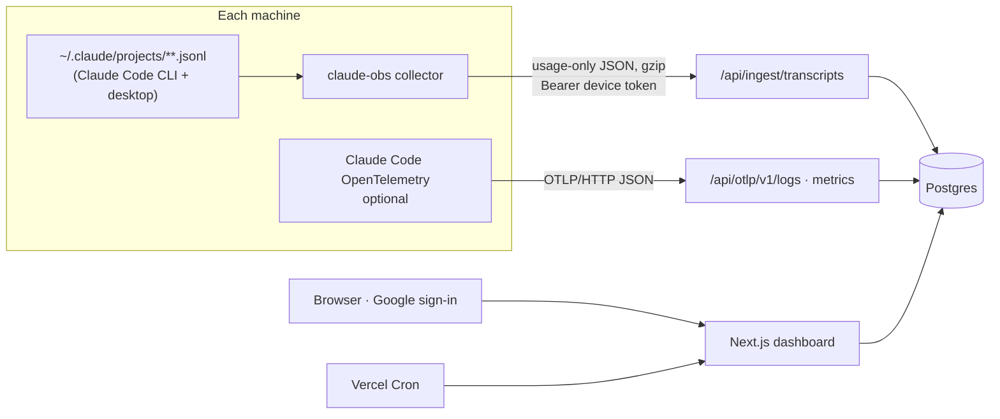

# Claude Observability

**See where a Claude subscription's usage goes.** Sessions, models, projects, 5-hour limit blocks and the
API-equivalent value of every token, across every machine that shares the account.

Built for Claude **Max / Pro** subscribers, who get no usage API from Anthropic, and for small teams sharing one
subscription. A tiny collector on each computer reads Claude Code's local session files and uploads **usage
numbers only**, never prompts, code or responses. A Next.js dashboard turns them into account-level analytics.

[](LICENSE)

> Not affiliated with or endorsed by Anthropic. "Claude" and "Claude Code" are trademarks of Anthropic, PBC.

---

## Contents

- [What you get](#what-you-get)
- [How it works](#how-it-works)
- [Privacy: what is and isn't collected](#privacy-what-is-and-isnt-collected)
- [Accuracy and limitations](#accuracy-and-limitations)
- [Quick start (local)](#quick-start-local)
- [The `claude-obs` collector](#the-claude-obs-collector)
- [Deploying to Vercel](#deploying-to-vercel)
- [Configuration reference](#configuration-reference)
- [Project structure](#project-structure)
- [HTTP API](#http-api)
- [Data model](#data-model)
- [Development](#development)
- [Security](#security)
- [Roadmap](#roadmap)
- [Contributing](#contributing)
- [License](#license)

---

## What you get

| Page | What it shows |
|---|---|
| **Overview** | Current 5-hour block (value used, burn rate, projection, reset time), plan value multiple for the billing cycle, data completeness (which machines are reporting), KPI tiles with period-over-period deltas, daily usage stacked by model, top insights, model mix, top sessions |
| **Sessions** | Every session with title, project · branch, duration, models, requests, subagent share, compactions and value; search, filter by model or project, and sort |
| **Session detail** | Context size per request (with compaction markers), value per request by model, subagent breakdown, Claude Code's own accounting, full request table with tokens, effort and latency |
| **Models** | Tokens per day by model; per-model requests, input/output/thinking, cache reads and writes (5m / 1h), cache hit rate, effective $/MTok, latency; effort mix; CLI vs desktop; subagent types; skills and plugins |
| **Projects** | Value, sessions, branches and Opus share per project folder |
| **Limits** | Live block meter, every 5-hour block in range, blocks that hit a limit, a **learned limit** from your own limit hits, an hour-of-week heatmap, and manual "I hit a limit" marking |
| **Plan value** | Cumulative API-equivalent value against your plan price, value by billing cycle, projection, and a right-sizing note |
| **Insights** | Rule-based findings (limit pressure, cache-hit drops, runaway sessions, Opus-heavy weeks, silent machines, unseen usage, plan fit) and an optional weekly AI digest built from aggregates only |
| **Alerts** | Slack, webhook or e-mail when a block nears the learned limit, a limit is hit, daily or weekly value crosses a threshold, or a machine goes silent |
| **Settings** | Plan and price, timezone and renewal day, people with access (owner or viewer), machines (rename or revoke), enrollment codes, the Claude-account pin, data quality, read-only share links, delete |

All dollar figures are **API-equivalent value**: what the same tokens would cost on Anthropic's pay-as-you-go
API. On a subscription, that's the value you get, not money you spend.

---

## How it works

Nothing is pulled from Anthropic, because individual subscriptions have no usage API. **Each machine pushes:**



1. **Collector.** `claude-obs` reads only the bytes appended since its last run. It parses an allowlist of fields,
   collapses Claude Code's repeated per-content-block lines into one row per request, and writes batches to a
   durable outbox before uploading. It can run once, in a watch loop, or as a background service.
2. **Optional telemetry.** Claude Code's own OpenTelemetry events add request latency and the side requests
   (session titles, classifiers) that never reach the session files.
3. **Server.** Uploads are authenticated per machine and pinned to one Claude account through a salted hash.
   Each request is **upserted by request id**, so the same request from two machines, two sources, or a re-sync
   is stored once. Each request is priced from the bundled price book.
4. **Dashboard.** Server-rendered pages query Postgres. The live block refreshes every 30 seconds. Scheduled jobs
   evaluate alerts, write the weekly digest and enforce retention.

**One workspace = one Claude account.** If several people share a subscription, enroll every machine that uses
it. The dashboard shows correct account-level totals and 5-hour blocks, deliberately without a per-person
breakdown.

---

## Privacy: what is and isn't collected

**Uploaded, per request:** request and message ids, session id, timestamp, model, token counts (input, output,
thinking, cache read, cache write 5m and 1h), web search and fetch counts, service tier, speed, inference
region, effort, subagent type, skill and plugin names, entry point (`cli` or `claude-desktop`), Claude Code
version, the **project folder's basename** (or a salted hash), and the git branch.

**Uploaded, per session:** title (turn off with `claude-obs config titles off`), compaction and turn-duration
events, error *categories* (for example `prompt_too_long`, `network`), usage-limit hits, and Claude Code's own
cost summary.

**Never uploaded:** prompts, responses, thinking, code, file contents, tool inputs or outputs, full paths,
e-mail addresses, or Claude credentials. The collector reads the Claude account id only to compute a salted
hash, and never reads OAuth tokens or the keychain.

How this is enforced:
- Output records are built field by field, with no object spreading.
- A test plants marker strings in content, e-mails and paths and fails if any of them appear in an upload.
- The OTLP receiver ignores content attributes even if a user has turned on `OTEL_LOG_USER_PROMPTS`.
- `claude-obs sync --dry-run` prints exactly what would be sent.

---

## Accuracy and limitations

- **Deduplication.** Claude Code writes one line per content block and repeats `usage` on each, and
  `output_tokens` grows while a response streams. On real data, 10,422 lines were only 1,990 requests. The
  collector keeps one row per request id with the largest output; the server upserts with `GREATEST()`.
- **Verified totals.** On real history, the collector's totals matched an independent script (1,924 requests,
  $235.18 vs $235.27; the gap was one request made while both ran). Where Claude Code recorded its own cost for
  a single-run session, the values matched to the cent.
- **Session files miss about 5–10%.** Claude Code's side requests (titles, classifiers) don't reach the session
  files. Run `claude-obs otel --install` on each machine for exact totals; both sources merge by request id.
- **Limits are modelled.** Anthropic doesn't publish limit sizes or exact reset rules. Blocks start at the first
  request after the previous block expires (rounded down to the hour) and last 5 hours. The "learned limit" is
  the median value at which *this account* actually hit a limit, so it needs at least one recorded hit.
- **Invisible usage.** claude.ai chat and cloud Claude Code sessions share the same limits but leave no local
  files. The dashboard flags limit hits that happened with little tracked usage.
- **Prices.** API list prices as of 2026-10-08, in [`packages/shared/src/pricing.ts`](packages/shared/src/pricing.ts).
  Unknown models are stored and counted as unpriced until added.
- **Transcript format.** Claude Code's session files are internal and undocumented. The parser tolerates unknown
  record types and reports them in Settings → Data quality.

---

## Quick start (local)

**Prerequisites:** Node.js 20+ and PostgreSQL 15+.

1. Install dependencies and create the local environment file:
   ```bash
   npm install
   ```
   ```bash
   cp apps/web/.env.example apps/web/.env.local
   ```
2. Edit `apps/web/.env.local`:
   - Set `DATABASE_URL`.
   - Set `BETTER_AUTH_SECRET` (`openssl rand -base64 32`).
   - Set `BETTER_AUTH_URL=http://localhost:3100`.
   - Set `CRON_SECRET`.
   - Keep `DEV_PASSWORD_LOGIN=1` to sign in without Google during development.
3. Create the database tables and start the app:
   ```bash
   npm run db:migrate -w @claude-obs/web
   ```
   ```bash
   npm run dev
   ```
4. Open http://localhost:3100, sign in, create a workspace, and open **Connect machines** to create an
   enrollment code.
5. On the same machine, build and run the collector from source:
   ```bash
   npm run build -w claude-obs
   ```
   ```bash
   node packages/cli/dist/index.js login --code XXXX-XXXX --server http://localhost:3100
   ```
   ```bash
   node packages/cli/dist/index.js sync
   ```

---

## The `claude-obs` collector

Install it on **every computer** where anyone runs Claude Code with the account:

```bash
npm install -g claude-obs
```

### Commands

| Command | What it does |
|---|---|
| `claude-obs login --code XXXX-XXXX [--name "Studio Mac"] [--server URL]` | Enroll with an owner-issued code. No dashboard login is needed on that machine. |
| `claude-obs login [--server URL]` | Enroll by approving a code in the browser instead |
| `claude-obs sync` | Upload everything new; the first run uploads all history |
| `claude-obs sync --watch` | Keep running and upload within seconds of new activity |
| `claude-obs sync --dry-run [--all] [--json]` | Print what would be uploaded; sends nothing |
| `claude-obs install-agent [--print]` / `uninstall-agent` | Run `sync --watch` in the background (launchd on macOS, systemd user unit on Linux, Task Scheduler on Windows). Requires a global install. |
| `claude-obs otel --print \| --install [--force] \| --uninstall` | Add or remove Claude Code's OpenTelemetry settings in `~/.claude/settings.json`, with a backup. Refuses to replace another collector unless you pass `--force`. |
| `claude-obs status` | Workspace, server check, Claude login and plan, tracked files, pending batches, agent state |
| `claude-obs config [titles on\|off] [hash-projects on\|off]` | Privacy switches |
| `claude-obs config-dirs [list \| add <path> \| remove <path>]` | Extra Claude Code config folders (`CLAUDE_CONFIG_DIR`) on this machine |
| `claude-obs show-last-upload` | The last batch the server accepted |
| `claude-obs resync` | Forget local progress and re-read all history (the server ignores duplicates) |
| `claude-obs doctor` | Check Node, credentials, server reachability, clock skew and file watching |
| `claude-obs logout` | Revoke this machine's token and delete local state |

### Files on disk

Stored in `~/.config/claude-obs/` (`%APPDATA%\claude-obs` on Windows; override with `CLAUDE_OBS_HOME`):
- `credentials.json` (mode 600)
- `config.json`
- `state.json`: file offsets and recently sent requests
- `outbox/`: batches waiting to upload; survives being offline
- `last-upload.json`
- `logs/agent.log`

### Environment variables

| Variable | Purpose |
|---|---|
| `CLAUDE_OBS_SERVER` | Default server URL |
| `CLAUDE_OBS_HOME` | Where the collector keeps its files |
| `CLAUDE_CONFIG_DIR` | Claude Code's config folder, if not `~/.claude` |
| `CLAUDE_OBS_SYSTEM_CA` | `0` turns off automatic trust of the OS certificate store |

**Corporate networks.** Security agents such as Netskope or Zscaler re-sign HTTPS traffic with a company
certificate. The collector trusts the operating system's certificate store automatically, so this works with no
setup on macOS and Linux (and on Windows with Node 22.19+). Details and manual fallbacks are in the
[collector README](packages/cli/README.md#corporate-networks-netskope-zscaler-proxies).

Full design: [docs/claude-obs.md](docs/claude-obs.md).

---

## Deploying to Vercel

Short version; [PLAN.md](PLAN.md) has the design.

1. **GitHub:** push this repository.
2. **Google OAuth:**
   - In Google Cloud Console → Google Auth Platform, set Audience to **External**.
   - Under Branding, add your domain plus privacy and terms URLs.
   - Under Data Access, add the scopes `openid`, `userinfo.email` and `userinfo.profile`.
   - Under Clients, create a **Web application** client with origin `https://<domain>` and redirect URI
     `https://<domain>/api/auth/callback/google`.
   - Publish the app.
3. **Vercel project:**
   - Import the repo with **Root Directory** set to `apps/web`.
   - Add **Neon** from Storage, which sets `DATABASE_URL` and `DATABASE_URL_UNPOOLED`, and match the function
     region to the database region.
   - Set the environment variables from the table below, then redeploy.
   - `vercel-build` runs migrations, then `next build`.
4. **Cron:** `apps/web/vercel.json` schedules the alert sweep daily (09:00 UTC), the digest weekly (Monday 08:00 UTC)
   and retention daily. These fit the Vercel **Hobby** plan. Hobby runs each job some time within the scheduled hour.
   Alerts also run after every upload, so a daily sweep only matters for "machine went silent" alerts. On **Pro**
   you can tighten the alert sweep to `*/15 * * * *`.
5. **Collector:**
   - Set your domain as the default in `packages/cli/src/api.ts`.
   - Publish with `npm publish -w claude-obs`. The `prepublishOnly` script runs typecheck, tests and the build.
6. **Check it:**
   - `https://<domain>/api/health` returns `{"ok":true}`.
   - You can sign in with Google, create a workspace and enroll a machine.

Google sign-in only works on URLs registered with the OAuth client, so random preview deployment URLs can't
sign in. Use production or a fixed staging domain with its own client.

---

## Configuration reference

All variables live in `apps/web` (`.env.local` locally, Vercel project settings in production).

| Variable | Required | Purpose |
|---|---|---|
| `DATABASE_URL` | yes | Postgres connection string (Neon **pooled** URL on Vercel) |
| `DATABASE_URL_UNPOOLED` | recommended | Direct connection, used for migrations |
| `BETTER_AUTH_SECRET` | yes | Session signing secret (`openssl rand -base64 32`) |
| `BETTER_AUTH_URL` | yes | Public base URL, no trailing slash |
| `GOOGLE_CLIENT_ID`, `GOOGLE_CLIENT_SECRET` | yes (production) | Google OAuth client |
| `CRON_SECRET` | yes | Protects `/api/cron/*`; Vercel Cron sends it automatically |
| `RESEND_API_KEY`, `ALERT_FROM_EMAIL` | no | E-mail alerts through Resend |
| `ANTHROPIC_API_KEY` | no | Weekly AI digest (Claude Opus 5.5, aggregates only) |
| `ALLOWED_EMAILS` | recommended | Comma-separated e-mails and/or `@domain.com` entries for **leads** who may sign in and create workspaces. People a lead invites can sign in to view only those workspaces; everyone else is refused at sign-in. Empty = any Google account. |
| `DEV_PASSWORD_LOGIN` | dev only | `1` enables e-mail/password sign-in; ignored when `NODE_ENV=production` |

---

## Project structure

```
.
├── packages/
│   ├── shared/            # zod wire schema + price book (used by both collector and server)
│   └── cli/               # claude-obs collector (bundled to a single dist/index.js)
│       └── src/           # parse · reader · discover · sync (collect/outbox/flush) · watch · agent · otel · store
├── apps/
│   └── web/               # Next.js 16 app
│       ├── drizzle/       # SQL migrations
│       ├── src/app/       # pages (/w/[id]/…), server actions, API routes
│       ├── src/lib/       # auth, db schema, ingest + merge, OTLP decoding, queries, blocks, insights, alerts, digest
│       ├── src/components # charts (Recharts), UI primitives, client widgets
│       └── test/          # unit tests
├── docs/claude-obs.md     # collector design spec
├── PLAN.md                # product plan, decisions and build status
└── LICENSE
```

**Stack:** Next.js 16 (App Router, React 19), TypeScript, Tailwind CSS 4, Better Auth (Google), Drizzle ORM +
postgres.js, Recharts, Zod 4, Vitest. Deployed on Vercel with Neon Postgres.

---

## HTTP API

| Endpoint | Auth | Purpose |
|---|---|---|
| `POST /api/cli/enroll` | enrollment code | Exchange a code for a device token |
| `POST /api/cli/device/start` · `POST /api/cli/device/poll` | none | Browser-approval login for the collector |
| `GET /api/cli/whoami` · `DELETE /api/cli/device` | device token | Check or revoke the device |
| `POST /api/ingest/transcripts` | device token | Gzipped batch of usage records (≤ 500, schema in `packages/shared`) |
| `POST /api/otlp/v1/logs` · `/api/otlp/v1/metrics` | device token | Claude Code OpenTelemetry (OTLP/HTTP **JSON** only) |
| `GET /api/w/:id/live` | session | Current 5-hour block |
| `GET /api/w/:id/export?range=30d` | session | CSV of requests |
| `GET /api/cron/{alerts,digest,retention}` | `CRON_SECRET` | Scheduled jobs |
| `GET /api/health` | none | Liveness |

Ingest returns `401` for an unknown token, `409` for a different Claude account, `413` for a batch that's too
large, `422` for a bad schema, `426` for an outdated collector, and `429` (with `retry-after`) when rate limited.

---

## Data model

Defined in [`apps/web/src/lib/db/schema.ts`](apps/web/src/lib/db/schema.ts).

| Group | Tables |
|---|---|
| Better Auth | `user`, `session`, `account`, `verification` |
| Tenancy | `workspaces` (one Claude account; pinned account hash, per-workspace hash salt, plan, timezone, renewal day), `memberships`, `invites`, `plan_periods` |
| Machines | `devices`, `enrollment_codes`, `device_auth_requests` |
| Facts | `api_requests` (primary key: workspace + request id), `session_meta`, `session_snapshots`, `session_events`, `error_events`, `limit_events`, `otel_metrics`, `ingest_log` |
| Product | `alert_rules`, `alert_events` (unique per rule + block or period), `digests`, `share_links` |

Retention: raw facts 13 months, ingest log 90 days.

---

## Development

| Command | What it does |
|---|---|
| `npm run dev` | Web app on http://localhost:3100 |
| `npm test` | All unit tests (collector, pricing, blocks, merge rules, OTLP, ranges) |
| `npm run typecheck` | TypeScript across all workspaces |
| `npm run build` | Shared → collector → web |
| `npm run db:generate -w @claude-obs/web` | New migration after editing `schema.ts` |
| `npm run db:migrate -w @claude-obs/web` | Apply migrations |
| `npm run build -w claude-obs` / `npm run dev -w claude-obs` | Build the collector (watch mode for `dev`) |

**Adding a model's price:** add a row to `PRICE_BOOK` in `packages/shared/src/pricing.ts`, using explicit cache
read and write prices; ratios differ by model. Then add a test in `pricing.test.ts`.

**Parsing a new transcript field:** extend `parse.ts` and the zod schema in `packages/shared/src/ingest.ts`, add a
fixture case in `packages/cli/test/collect.test.ts`, and keep the privacy test passing.

---

## Security

- Device tokens are random 256-bit values, stored only as SHA-256 hashes, and revocable per machine.
- Enrollment codes are hashed, expiring and use-limited.
- The browser-approval flow shows the requesting machine, OS and IP, and hands the token over exactly once.
- Sign-in can be restricted to an allowlist (`ALLOWED_EMAILS`) of leads plus the people they invite. The check runs when
  an account is created and on every sign-in, so removing someone takes effect at their next sign-in.
- Every page, query and server action checks workspace membership, and owner-only actions check the role.
- Uploads from a different Claude account than the one the workspace is pinned to are rejected.
- **Claude account e-mail check** (on by default, Settings → Claude account): machines must be logged into Claude
  with a workspace owner's e-mail or one on the workspace's extra list. The collector sends only a one-way hash of
  the e-mail (at login and with every upload), and the server compares it and discards it. Mismatches are refused
  at login, upload and telemetry; collectors older than 0.1.4 are asked to update. This stops mistakes and casual
  misuse. It isn't cryptographic proof, because the e-mail is self-reported by the machine.
- Webhook alert targets must be public `https` URLs (no private or loopback hosts). Slack targets must be on
  `hooks.slack.com`.
- Security headers are set: CSP, HSTS, `frame-ancestors 'none'`, `nosniff`. CSV exports neutralize spreadsheet
  formulas.
- Rate limits are in-memory per server instance; use a shared store such as Upstash before scaling out.

Found a vulnerability? Please report it privately to the maintainer instead of opening a public issue.

---

## Roadmap

- OTLP/HTTP protobuf support
- Postgres row-level security as a second layer of tenant isolation
- Standalone collector binaries (no Node), Homebrew tap, signed installers
- Connectors for organizations: Anthropic Admin Usage and Cost APIs, Claude Code Analytics API, Claude
  Enterprise Analytics API
- Playwright end-to-end tests and an ingest load test

---

## Contributing

Issues and pull requests are welcome. Please run `npm run typecheck` and `npm test` before opening a PR. Changes
to what the collector uploads need a matching update to the privacy section above and to the privacy test.

---

## License

[MIT](LICENSE) © 2026 Prakhar Gurunani
